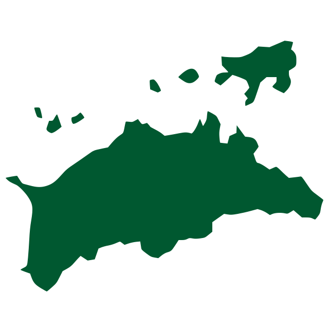
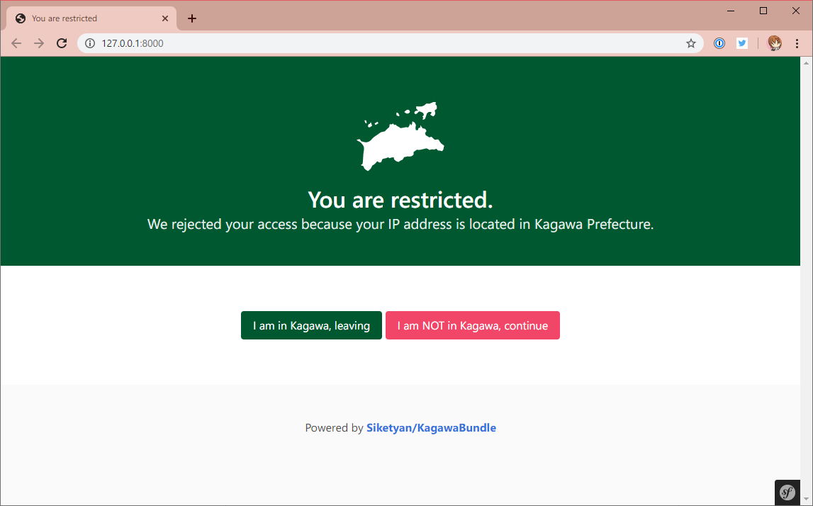

<div align="center">
  <p>
    
  </p>
  <h1>Kagawa Bundle</h1>
  <p>
    
    
    
  </p>
  <p>🚫 Kagawa Prefecture restriction for Symfony.</p>
</div>

<br>

## 🚚 Prequisites
- PHP ^7.3
- Symfony ^4.4
- MaxMind GeoIP Database (\*.mmdb)

## 📦 Installation
1. Download GeoIP database from MaxMind.  
   https://dev.maxmind.com/geoip/

1. Download the package from Packagist.
   ```console
   $ composer require siketyan/kagawa-bundle
   ```

1. Enable the bundle in **config/bundles.php** .
   ```diff
   <?php

   return [
       // ...
   +   Siketyan\KagawaBundle\SiketyanKagawaBundle::class => ['all' => true],
   ];
   ```

1. Configure in **config/packages/siketyan_kagawa.yaml** .
   ```yaml
   siketyan_kagawa:
     geoip_db: '/path/to/geoip_db.mmdb'
     message: 'Hint message'
   ```

## 📷 Screenshot

